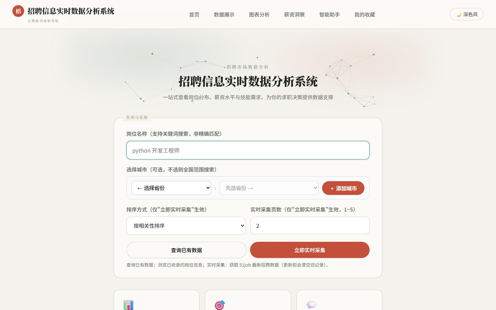
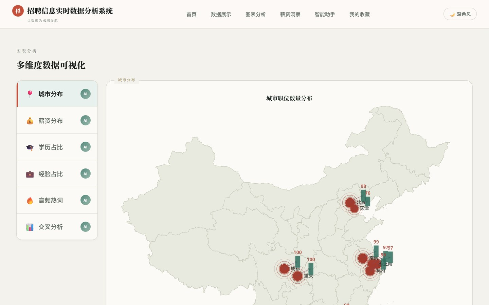
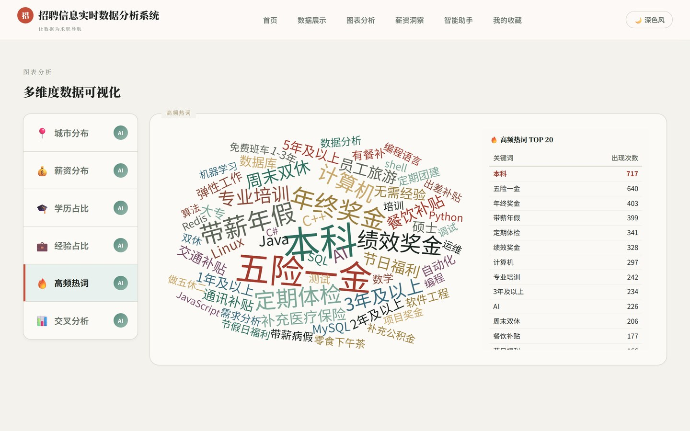
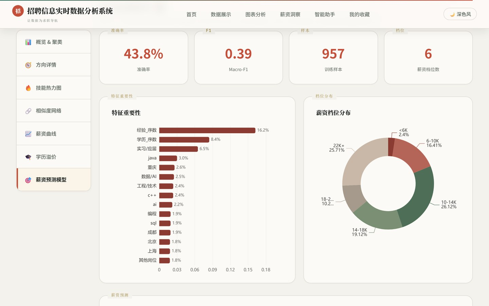
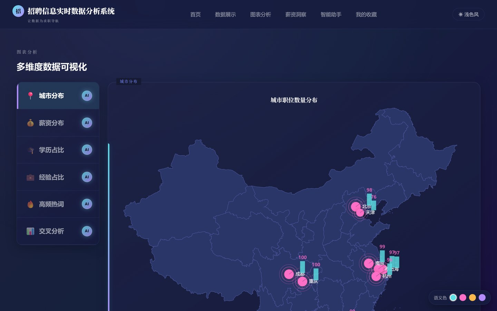

<div align="center">

# job-crawler

**招聘数据采集 · 统计分析 · 机器学习建模 · AI 求职建议，一条链路跑通。**

[](https://github.com/cloudy-one1/job-crawler/actions/workflows/ci.yml)
[](https://www.python.org/downloads/)
[](LICENSE)
[](CONTRIBUTING.md)

</div>

---

## 项目简介

面向 Python 岗位的招聘市场分析平台：用 Playwright 采集 51job 在招岗位，清洗入库后做多维度统计分析（薪资 / 学历 / 经验 / 城市 / 交叉），再用 scikit-learn 做岗位聚类与薪资建模，最后接入大语言模型，让数据结论变成可执行的求职建议，全部通过 Flask 网页端呈现。

**设计取向**：采集与展示分离——爬虫可独立、定期运行，Web 只负责读取已入库的数据；离线功能与 AI 功能解耦——不配任何密钥也能用完整的数据分析与建模能力。

## 功能特性

| 模块 | 能力 | 技术要点 |
|------|------|----------|
| 数据采集 | 51job 实时抓取（多城市 × 5 页上限） | Playwright 无头浏览器 + stealth 对抗 WAF、随机延时 |
| 增量入库 | 重复采集自动合并，不覆盖历史数据 | 按 job_url upsert + 「职位+公司+城市」收敛 + collected_at 时间戳，面议/脏记录排除 |
| 数据清洗 | 薪资字符串归一化、jobTags 关键字提取 | 正则规则引擎 |
| 描述性统计 | 薪资 / 学历 / 经验 / 城市分布 + 交叉分析 | Pandas + SQLite |
| 职位聚类 | 自动发现职位方向（判别性自动命名），点击簇卡片查看明细 | Jieba + TF-IDF + KMeans + 轮廓系数选 k + c-TF-IDF 命名 |
| 多维薪资分析 | 技能热力图、经验-薪资曲线、学历溢价、岗位相似度网络 | NumPy + 余弦相似度 |
| 薪资档位预测 | 三模型交叉验证选优，输出区间与特征重要性 | RandomForest / GradientBoosting / Logistic；特征含职位描述技能抽取，评估含偏差≤1档比例与档位MAE |
| 技能词云 | 基于官方 jobTags 的高频热词 | 同义词归一化 + echarts-wordcloud |
| AI 图表解读 | 图表页 6 区段、建模页 5 维度点击即解读 | DeepSeek → 通义千问 fallback + 服务端缓存 |
| AI Agent | 10 个工具函数的求职问答 | 数据概览预加载 + 单次 LLM 调用 |
| 岗位匹配推荐 | 六维度透明权重评分 | 技能 35% + 城市 / 学历 / 经验各 15% + 薪资 / 真实性各 10% |
| 简历审查 | PDF / DOCX 解析 → 岗位 Gap → 诊断与优化建议 | PyPDF2 / python-docx + LLM |
| 数据可视化 | 10 个页面，米色 / 深色双主题一键切换，含滚动入场、磁吸按钮、粒子场等交互动效 | Jinja2 + ECharts + 零依赖前端动效层 |

> **容错**：空数据库首次启动不会崩溃，所有页面友好提示「请先采集数据」，无需预先准备任何数据。

## 界面预览

> 截图为本地已采集数据下的实际运行效果，页面数值随每次采集整表更新。

**首页 · 查询与采集**



| 图表分析 · 城市分布 | 图表分析 · 高频热词 |
|:---:|:---:|
|  |  |

| 薪资洞察 · 预测模型 | 深色主题 |
|:---:|:---:|
|  |  |

## 快速开始

### 环境要求

- Python 3.10+
- 需要运行采集时额外安装浏览器内核：`playwright install chromium`
- AI 相关能力需要至少一个大模型密钥，其余功能离线可用

### 本地运行

```bash
git clone https://github.com/cloudy-one1/job-crawler.git
cd job-crawler

python -m venv .venv && source .venv/bin/activate   # Windows: .venv\Scripts\activate
pip install -r requirements.txt

cp .env.example .env      # 可选：填入 DEEPSEEK_API_KEY / QWEN_API_KEY
python app.py             # http://127.0.0.1:5000
```

### 导入数据

仓库不包含数据库文件，首次使用需要采集一次（约 3-10 分钟，取决于城市与页数）：

```bash
playwright install chromium
python -c "from data.python_job_scraper import scrape_jobs; scrape_jobs()"
```

也可以在网页端 `/collect` 页面填写关键词与城市后一键采集（带限流与可选口令保护）。

### Docker 运行

> 采集依赖真实浏览器指纹对抗 WAF，需在**宿主机**执行并写入 `data.db`；容器只负责 Web 展示、模型推理与 Agent，通过 volume 共享同一个数据库。

```bash
docker compose up -d      # http://localhost:5000
docker compose logs -f
docker compose down
```

### 其他命令

```bash
make help        # 查看全部命令
make test        # 运行测试
make run         # 启动服务
make crawl       # 采集一次数据
```

## 目录结构

```
job-crawler/
├── app.py                  # Flask 入口：路由、渲染、安全与缓存
├── config.py               # 配置：数据库路径与环境变量常量
│
├── data/                   # 数据层：采集与清洗
│   ├── python_job_scraper.py   # 51job 采集（Playwright + stealth）
│   ├── job_store.py            # 落库统一口径（job_url upsert + collected_at + 清洗规则）
│   ├── salary_parser.py        # 薪资解析（统一归一化为千元/月）
│   └── exper_parser.py         # 经验口径归一（最低年限 → 5 个有序档位）
│
├── analysis/               # 分析层：描述性统计
│   ├── xinzi.py                # 薪资分段
│   ├── xueli.py / jinyan.py    # 学历 / 经验分布
│   ├── region.py               # 城市分布 + extract_city 口径
│   ├── cross.py                # 薪资 × 经验 / 薪资 × 学历
│   ├── jobtitle.py             # 职位规则分类（40+ 行业、5 层优先级）
│   └── wordcloud_gen.py        # 高频热词
│
├── modeling/               # 建模层：机器学习与多维分析
│   ├── job_clustering.py       # KMeans 聚类（自动选 k + 轮廓系数）
│   ├── salary_classifier.py    # 薪资档位分类（三模型 CV 选优）
│   ├── skill_heatmap.py        # 技能供需热力图
│   ├── job_similarity.py       # 岗位相似度网络
│   ├── salary_curve.py         # 经验-薪资成长曲线
│   ├── edu_premium.py          # 学历溢价分析
│   └── salary_predict.py       # 薪资分位数统计查询
│
├── agent/                  # Agent 层：大模型能力
│   ├── agent_core.py           # LLM 调用封装（双模型 fallback + 退避重试）
│   ├── agent_tools.py          # 10 个工具函数
│   └── resume_parser.py        # 简历解析（PDF / DOCX）
│
├── templates/              # 页面模板（10 个）
├── static/                 # 主题样式、前端脚本与动效层（fx.js / fx-motion.css）
├── tests/                  # 测试（318 个用例）
├── docs/                   # 文档
│   ├── ARCHITECTURE.md         # 分层架构、数据模型与关键设计决策
│   ├── CONFIGURATION.md        # 环境变量与配置说明
│   └── images/                 # README 界面预览截图
├── .github/                # CI 工作流、issue / PR 模板
└── data.db                 # SQLite 数据库（运行时生成，不入库）
```

## 文档

- [架构说明](docs/ARCHITECTURE.md) —— 分层职责、数据模型、缓存与安全设计、扩展指引
- [配置说明](docs/CONFIGURATION.md) —— 环境变量全表、AI 功能开关、Debug 机制
- [更新日志](CHANGELOG.md) —— 版本变更记录
- [贡献指南](CONTRIBUTING.md) —— 开发环境、代码规范与 PR 流程

## 测试

```bash
pytest                       # 全量 318 个用例
pytest tests/test_cross.py   # 单个模块
```

CI 在 Python 3.10 / 3.11 / 3.12 上自动运行，详见 [ci.yml](.github/workflows/ci.yml)。

## 路线图

- [ ] 支持BOSS 直聘、拉勾等多数据源接入
- [x] 采集任务增量更新（按 job_url upsert，不再整表替换，2026-09）
- [ ] 岗位数据时间序列，观察薪资趋势变化（增量采集已就位，`collected_at` 已落库，等数据积累多期）
- [ ] 聚类结果的可解释性增强（c-TF-IDF 判别性命名已交付，簇关键词摘要仍在深化）
- [ ] 前端构建流程与组件化
- [ ] 多用户与结果分享

欢迎在 [Issues](https://github.com/cloudy-one1/job-crawler/issues) 提出想法或认领任务。

## 参与贡献

提交 PR 前请先阅读 [贡献指南](CONTRIBUTING.md) 与 [行为准则](CODE_OF_CONDUCT.md)。
安全问题请通过 [SECURITY.md](SECURITY.md) 中的方式私下报告。

## 许可证

本项目基于 [MIT License](LICENSE) 开源。

## 免责声明

本项目仅用于数据分析技术学习与研究。采集功能请遵守目标网站的服务条款与 `robots.txt`，控制请求频率，勿用于商业用途或大规模抓取。所采集数据的版权归原网站所有，分析结果不构成任何求职或薪酬决策建议。
